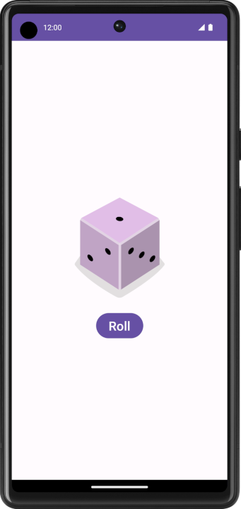

# Dice Roll Android App

Basic Android app that rolls a dice everytime the "Roll" button is pressed

Made with Android Studio using Kotlin, as part of Android Basics with Compose course (by Google), marking the beginning of my journey as an Android developer!

## App Preview:

